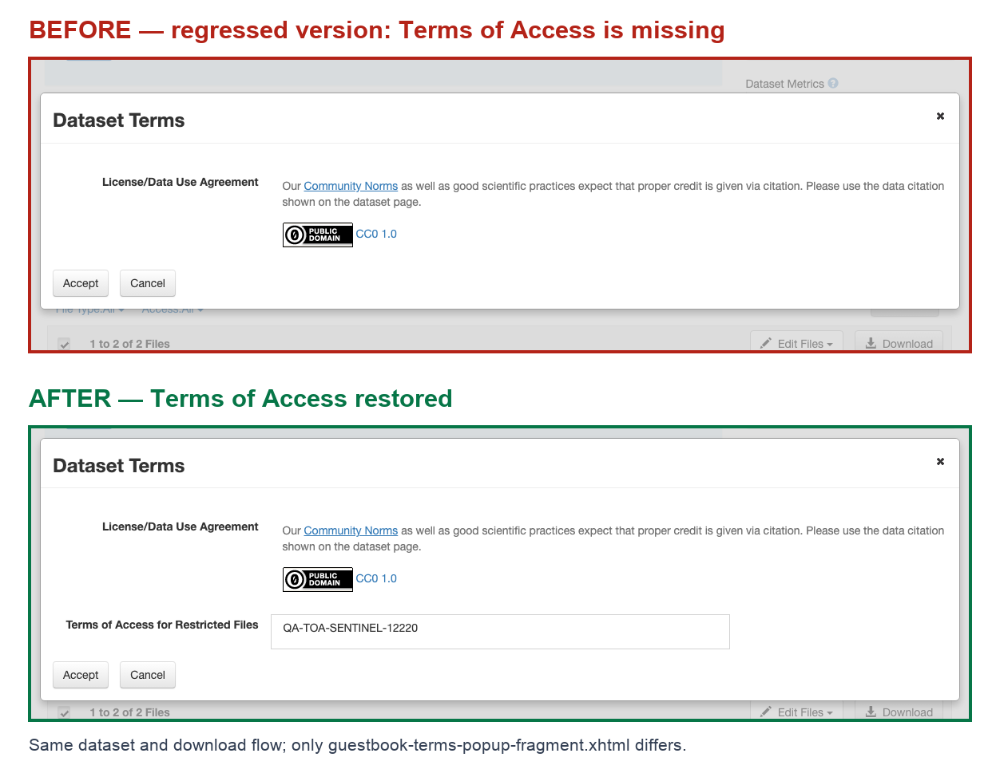

# Pydataverse Solution

> Dataverse / pyDataverse 工程问题的持续解决记录。每完成一个问题，就在本文末尾追加完整过程，而不仅记录最终答案。

## 更新约定

每篇记录都应包含问题、复现、调查操作、遇到的失败、沟通方式、最终 solution、验证证据、修复效果，以及是否已经 merge/release。新增内容不得包含密码、API token、session cookie 或其他敏感信息。

## 目录

1. [Solution 001 — Dataverse Guestbook Cancel 修复与 Terms of Access 回归调查](#solution-001--dataverse-guestbook-cancel-修复与-terms-of-access-回归调查)

---

## Solution 001 — Dataverse Guestbook Cancel 修复与 Terms of Access 回归调查

> 关联 Issue：[IQSS/dataverse#12205](https://github.com/IQSS/dataverse/issues/12205)  
> 主 PR：[IQSS/dataverse#12220](https://github.com/IQSS/dataverse/pull/12220)  
> 补充 PR：[IQSS/dataverse#12608](https://github.com/IQSS/dataverse/pull/12608)  
> 状态更新时间：2026-08-13

### 1. 结论摘要

本次工作实际涉及两个彼此独立的问题：

1. **原始问题：Guestbook Response 弹窗中的 Cancel 按钮无效。**
   - 修复已在 PR #12220 的当前分支中实现。
   - Preview、Download 和 Request Access 三种上下文分别使用正确的取消行为。

2. **评审中发现的回归：Terms of Access 在弹窗中可能不显示。**
   - 原因是 `rendered` 条件误用了 `disclaimer`，同时引用了不存在的 bundle key。
   - 两行修复已直接加入 PR #12220。
   - 受控 A/B 测试证明该回归可稳定复现，修复后可稳定恢复显示。

截至 2026-08-13：

| 项目 | 状态 |
|---|---|
| Cancel 修复代码 | ✅ 已在 #12220 当前分支中 |
| Terms of Access 修复 | ✅ 已在 #12220 当前分支中 |
| JSF 测试 | ✅ 43/43 通过 |
| Integration Tests | ✅ 通过 |
| CodeQL | ✅ 通过 |
| Read the Docs | ✅ 通过 |
| Review | ✅ Approved |
| Merge 状态 | ✅ Mergeable / Clean |
| PR #12220 | ⏳ 仍为 Open，尚未合并进 `develop` |
| Issue #12205 | ⏳ 仍为 Open，通常会在主 PR 合并后关闭 |
| PR #12608 | ✅ 已关闭，因为修复已直接进入 #12220 |

因此，**从代码、测试和评审角度已经解决；从项目交付角度还差维护者正式合并 #12220。** 在合并并进入发布版本前，不能说该修复已经发布到用户环境。

---

### 2. 原始问题是什么

#### 2.1 用户可见问题

Dataverse 6.9 的 JSF UI 中，如果数据集配置了需要填写的 Guestbook：

1. 用户进入一个已发布的数据集；
2. 尝试预览文件、下载文件或请求访问受限文件；
3. 系统打开 Guestbook Response / Dataset Terms 界面；
4. 用户点击 **Cancel**；
5. 弹窗或 Preview tab 没有关闭，界面没有按预期返回。

原 Issue 给出的临时绕过方法是使用浏览器的 Back 按钮。

#### 2.2 预期行为

- **Download 对话框：** Cancel 应关闭弹窗，并留在 Files 页面。
- **Request Access 对话框：** Cancel 应关闭弹窗，并且不提交访问请求。
- **Preview tab：** Cancel 应离开 Guestbook Response 视图并返回 Files tab。
- Cancel 不应触发 Guestbook 必填字段校验，也不应写入 Guestbook response。

---

### 3. 主 PR #12220 的解决方案

主要修改文件：

```text
src/main/webapp/guestbook-terms-popup-fragment.xhtml
```

#### 3.1 根据上下文分别处理 Cancel

原先使用普通 HTML `<button>`。最终代码改为 PrimeFaces `p:commandButton`，并区分 Preview 与普通 Dialog。

##### Preview tab

```xhtml
<p:commandButton styleClass="btn btn-default" value="#{bundle.cancel}"
                 rendered="#{popupContext == 'previewTab'}"
                 onclick="history.back();"
                 update="fileForm:tabView">
</p:commandButton>
```

效果：用户在 Preview Guestbook 页面点击 Cancel 后返回之前的文件页面/Files tab。

##### Download 等普通 Dialog

```xhtml
<p:commandButton styleClass="btn btn-default" value="#{bundle.cancel}"
                 rendered="#{popupContext != 'previewTab'}"
                 onclick="PF('guestbookAndTermsPopup').hide();">
</p:commandButton>
```

效果：点击 Cancel 直接关闭 `guestbookAndTermsPopup`。

##### Request Access

Request Access 区块的 Cancel 同样改为：

```xhtml
<p:commandButton styleClass="btn btn-default" value="#{bundle.cancel}"
                 onclick="PF('guestbookAndTermsPopup').hide();">
</p:commandButton>
```

效果：关闭请求访问弹窗，不提交请求。

#### 3.2 避免 Cancel 触发 Guestbook 校验

Guestbook 输入项的 `required` 取决于：

```xhtml
DO_GB_VALIDATION_#{popupContext}
```

只有 Accept / Request Access 等真正提交操作的按钮会传入：

```xhtml
<f:param name="DO_GB_VALIDATION_#{popupContext}" value="true"/>
```

Cancel 按钮不传这个参数，所以 Cancel 不会因为 Name、Email 或其他 Guestbook 必填项为空而被校验阻止。

#### 3.3 Release note

PR 还增加了：

```text
doc/release-notes/12205-guestbook-response-jsf-popup-cancel-button.md
```

说明修复后 Dialog 会关闭，Preview tab 会返回 Files tab。

---

### 4. 评审时发现的第二个问题

#### 4.1 问题内容

在审查 #12220 相对于 `develop` 的完整 diff 时，发现 Terms of Access 区块出现了与 Cancel 无关的两处变化：

1. `rendered` 条件从 `termsOfAccess` 错误改成了 `disclaimer`；
2. bundle key 被改成一个 `Bundle.properties` 中不存在的 key。

错误逻辑相当于：

```xhtml
jsf:rendered="#{!empty workingVersion.termsOfUseAndAccess.disclaimer}"
```

错误 key 为：

```text
file.dataFilesTab.terms.list.termsOfUse.addInfo.termsOfsAccess
```

#### 4.2 用户影响

这会导致：

- 数据集设置了 Terms of Access，但 Disclaimer 为空时，Terms of Access 完全不显示；
- 用户可能在下载或请求受限文件时看不到应该接受的访问条款；
- 如果 Disclaimer 有值但 Terms of Access 为空，界面可能渲染空行；
- 无效 bundle key 可能显示为 `???key???`，而不是正常标签。

这不是 Cancel bug 本身，但如果跟随 #12220 一起进入 `develop`，会引入新的 UI 和合规语义回归，因此必须一起纠正。

#### 4.3 最终两行修复

```xhtml
<div class="form-group"
     jsf:rendered="#{!empty workingVersion.termsOfUseAndAccess.termsOfAccess and (hasRestrictedFile or !empty fileDownloadHelper.filesForRequestAccess)}">
    <label jsf:for="fdTermsOfAccess" class="col-sm-3 control-label">
        #{bundle['file.dataFilesTab.terms.list.termsOfAccess.termsOfsAccess']}
    </label>
```

它恢复了两个关键行为：

- 根据真正显示的字段 `termsOfAccess` 决定是否渲染；
- 只在存在受限文件或待请求访问文件时显示；
- 使用项目中实际存在的 bundle key。

---

### 5. 调查和操作过程

#### 第一步：审查完整 diff

不是只看 Cancel 按钮附近的代码，而是把 #12220 与 `develop` 的完整差异逐段检查。

这一过程发现：

- 大量代码只是缩进/格式调整；
- 真正的 Cancel 修改集中在文件后半部分；
- Terms of Access 的两行语义变化与 Cancel 无关，属于额外风险。

#### 第二步：提交 inline review 建议

在 #12220 中明确说明：

- 条件应该检查 `termsOfAccess`，而不是 `disclaimer`；
- 当前 bundle key 不存在；
- 建议恢复原来的两行；
- Cancel 实现本身的校验逻辑看起来正确。

该建议最初进入共同署名 commit：

```text
e2fe762e — Update src/main/webapp/guestbook-terms-popup-fragment.xhtml
```

#### 第三步：CI 出现红叉

`e2fe762e` 的 JSF workflow 中，`13-dataset-actions` 出现 Select All 失败。因为失败发生在新增两行之后，表面上容易认为两行修复导致了失败。

随后 commit：

```text
257febcb — undo last commit
```

撤销了该建议。此时 CI 变绿，但 Terms of Access 回归也被重新带回。

#### 第四步：判断失败是否有因果关系

为了避免把“时间上先后发生”误判为“代码导致失败”，进行了受控 A/B 实验。

##### Variant A

包含 Terms of Access 两行修复的预览镜像。

##### Variant B

与 A 完全相同，只把：

```text
guestbook-terms-popup-fragment.xhtml
```

替换为撤销后的版本。

##### 控制变量

每轮保持或固定：

- Dataverse 应用版本；
- PostgreSQL 与 Solr 配置；
- 测试 runner revision；
- Node、npm 和 Playwright 版本；
- 测试账号；
- 数据集和浏览器操作；
- A/B 之间唯一有意差异是目标 XHTML 文件。

#### 第五步：重复测试 `13-dataset-actions`

测试结果：

| Variant | 独立全新环境运行 | CI 顺序前缀运行 | 合计 |
|---|---:|---:|---:|
| A：包含两行修复 | 3/3 通过 | 1/1 通过 | 4/4 通过 |
| B：撤销两行修复 | 3/3 通过 | 1/1 通过 | 4/4 通过 |

结论：两行 Terms of Access 修复对 Select All 失败没有可观察影响。之前的失败更符合测试波动或独立的 Select All 问题，而不是该 XHTML 条件或 bundle key 导致。

另外，失败 trace 中没有：

- `filesTable` 的 `toggleSelect` 请求；
- JSF / EL / bundle 错误；
- Terms of Access fragment 的实际渲染。

对应 fixture 也没有 Terms of Access、Disclaimer、Guestbook 或受限文件，因此本来就不会经过这个区块。

#### 第六步：对 Terms of Access 做可逆 A/B 验证

准备一个固定数据集：

- 已发布；
- 有一个 restricted file；
- 配置 Guestbook；
- Disclaimer 为空；
- Terms of Access 设置唯一 sentinel：`QA-TOA-SENTINEL-12220`。

使用相同数据库、相同数据和相同浏览器脚本，只切换应用容器：

```text
B → A → B → A
```

结果：

| 顺序 | Variant | Terms of Access |
|---:|---|---|
| 1 | B（撤销版） | ❌ 缺失 |
| 2 | A（修复版） | ✅ 显示 |
| 3 | B（撤销版） | ❌ 缺失 |
| 4 | A（修复版） | ✅ 显示 |

这证明该回归和两行修复之间存在稳定、可逆的因果关系。

#### 第七步：运行完整 JSF 测试

在包含修复的 Variant A 上运行完整官方 JSF 测试集：

```text
43/43 passed
```

覆盖 Chromium、Firefox 和 WebKit，并包含此前失败的 `13-dataset-actions`。

#### 第八步：建立补充 PR #12608

为了让两行修复与主 Cancel 修改清晰分离，创建：

- [PR #12608 — Restore Terms of Access rendering in PR #12220](https://github.com/IQSS/dataverse/pull/12608)

该 PR 的生产代码差异仅为上述两行，并附上：

- 官方 JSF workflow；
- 独立分支 workflow；
- 43/43 通过结果；
- A/B 调查结论。

#### 第九步：按 Philip 的要求提供截图

Philip 表示仅看文字不容易理解问题，并请求 screenshot。

因此使用同一个数据集、同一个下载流程制作 Before/After 对照图：



- Before：Dataset Terms 弹窗没有 Terms of Access；
- After：`Terms of Access for Restricted Files` 和 sentinel 正确显示。

#### 第十步：把修复归并到主 PR

Philip 请 Steven 判断是否把 #12608 的修复加入 #12220。

Steven 随后把等价的两行修复直接应用到主 PR：

```text
bf019c4 — Update src/main/webapp/guestbook-terms-popup-fragment.xhtml
```

然后将最新 `develop` 合并到该分支：

```text
ad315c1 — Merge branch 'develop' into 12205-guestbook-response-jsf-popup-cancel-button
```

由于修复已经存在于 #12220，#12608 被关闭为 **superseded**，避免两个 PR 重复合并相同修改。

---

### 6. 遇到的问题以及如何解决

#### 6.1 大量格式变化掩盖了真正语义变化

**问题：** XHTML 前半部分存在大量缩进调整，使两行真正的逻辑回归不容易发现。

**处理：** 与 `develop` 做完整语义 diff，不把大段 reformat 默认视为无风险。

#### 6.2 CI 红叉造成了错误归因风险

**问题：** 修复提交后恰好有一个 JSF 测试失败，看起来像新改动导致。

**处理：** 不靠猜测或单次 rerun，而是构造只差一个文件的 A/B 环境，多次重复相同测试。

#### 6.3 为了变绿而回退，重新引入了真实回归

**问题：** `257febcb` 让当时的 checks 变绿，但也恢复了 Terms of Access 缺失问题。

**处理：** 用两套证据分别回答：

- Select All 失败与两行修复无因果证据；
- Terms of Access 缺失与两行错误存在稳定因果关系。

之后重新提交两行修复。

#### 6.4 文字说明不足以让 reviewer 快速理解

**问题：** Philip 无法仅凭 PR 描述快速理解 UI 问题。

**处理：** 提供受控 Before/After 截图，确保同一数据、同一流程、唯一差异清楚可见。

#### 6.5 补充 PR 与主 PR 的归属问题

**问题：** 两行修复在 #12608 中，但最终产品修改应随 #12220 一起合并，容易形成重复 PR。

**处理：** Steven 将等价修复直接应用到 #12220；确认最新 CI 通过后关闭 #12608，并说明 `superseded`。

#### 6.6 Commit 页面仍显示历史红叉

**问题：** `e2fe762` 和 `bf019c4` 在 Commits 页面仍有红叉，看起来像还没解决。

**解释：** GitHub 保留每个历史 commit 当时的检查结果，后续 commit 通过不会把旧记录改绿。

- `e2fe762`：当时 JSF workflow 有一次失败；
- `bf019c4`：新 commit 很快到来，旧 JSF/Integration workflow 被取消，同时旧 Read the Docs build 失败；
- 最新 `ad315c1`：所有当前检查通过。

因此无需为了历史红叉修改代码。合并判断看当前 HEAD，而不是要求所有历史 commit 都变绿。

---

### 7. 沟通方式与关键原则

本次沟通采用以下方式：

1. **先说明具体代码问题，而不是只说“这里不对”。**
   - 指明错误字段 `disclaimer`；
   - 指明正确字段 `termsOfAccess`；
   - 指明错误和正确 bundle key；
   - 附可直接应用的 suggestion。

2. **把两个问题明确分开。**
   - Cancel button 修复是一件事；
   - Terms of Access 回归是另一件事；
   - `13-dataset-actions` 的 Select All 失败又是独立问题。

3. **避免只凭一次 CI 结果下结论。**
   - 用多轮 A/B 和固定变量说明因果关系；
   - 同时提供原始日志、trace、截图和 workflow 链接。

4. **Reviewer 表示不理解时，改用视觉证据。**
   - Before/After 截图比继续增加长篇文字更有效。

5. **修复进入主 PR 后及时清理重复工作。**
   - 更新 #12220；
   - 关闭 #12608；
   - 明确“修复已应用”不等于“主 PR 已合并”。

沟通中应使用准确表述：

```text
Steven applied the fix to PR #12220.
```

或：

```text
Steven applied the equivalent two-line fix directly to PR #12220,
so PR #12608 was closed as superseded.
```

在 #12220 仍为 Open 时，不应说：

```text
PR #12220 has been merged.
```

---

### 8. 最终解决方案

最终 solution 由两部分组成。

#### Solution A：修复 Cancel 行为

- 使用 PrimeFaces `p:commandButton`；
- Preview tab 的 Cancel 使用 `history.back()` 并更新 `fileForm:tabView`；
- Download/Request Access dialog 的 Cancel 调用 `PF('guestbookAndTermsPopup').hide()`；
- Cancel 不传 `DO_GB_VALIDATION_<context>`，因此不会触发 Guestbook 必填校验或提交。

#### Solution B：恢复 Terms of Access

- `rendered` 使用 `termsOfAccess`；
- 保留 restricted/request-access guard；
- 使用存在的 bundle key：

```text
file.dataFilesTab.terms.list.termsOfAccess.termsOfsAccess
```

这两部分现在都位于 #12220 当前 HEAD `ad315c1f`。

---

### 9. 解决后达到的效果

#### 用户体验

- 点击 Cancel 后界面有明确响应，不再“什么都不发生”；
- 用户无需通过浏览器 Back 按钮绕过；
- Preview、Download、Request Access 三种入口获得与各自上下文匹配的退出行为。

#### 数据正确性

- Cancel 不提交 Guestbook response；
- Cancel 不发起 Request Access；
- Cancel 不受 Guestbook required fields 阻止。

#### 条款展示正确性

- 有 Terms of Access 且涉及受限/请求访问文件时，条款正确显示；
- Disclaimer 为空不会再错误隐藏 Terms of Access；
- 不再引用不存在的 bundle key；
- 用户在接受/请求访问前能看到应该看到的条款。

#### 工程质量

- A/B 实验排除了错误因果归因；
- 完整 JSF、Integration、CodeQL 和文档检查通过；
- 重复 PR 已清理；
- 最终分支为 Approved、Mergeable、Clean。

---

### 10. 最终是否已经解决

答案需要分两层：

#### 技术层面：是

- Cancel 修复已实现；
- Terms of Access 回归已修复；
- 最新 HEAD 的全部 required checks 已通过；
- PR 已获批准并可合并。

#### 项目交付层面：还差最后一步

- PR #12220 目前仍是 **Open**；
- 尚未正式合并进 `develop`；
- Issue #12205 仍为 Open；
- 修复尚未随正式 Dataverse release 发布。

因此最准确的结论是：

> **The fix is complete and validated on PR #12220, and the PR is ready to merge. It is not yet merged or released.**

---

### 11. 证据与文件位置

#### 仓库内证据

```text
assets/solution-001-terms-of-access-before-after.png
```

完整 A/B 原始产物约 1.7GB，保留在本地实验环境中，没有提交到公开仓库；关键方法、结果和公共 CI 链接已记录在本文中。

#### GitHub 证据

- Issue #12205：<https://github.com/IQSS/dataverse/issues/12205>
- 主 PR #12220：<https://github.com/IQSS/dataverse/pull/12220>
- 补充 PR #12608：<https://github.com/IQSS/dataverse/pull/12608>
- 最新 JSF workflow（43/43）：<https://github.com/IQSS/dataverse/actions/runs/31705546363>
- 最新 Integration workflow：<https://github.com/IQSS/dataverse/actions/runs/31705546389>
- 曾失败的 JSF workflow：<https://github.com/IQSS/dataverse/actions/runs/31608775356>

---

### 12. 可复用经验

1. 大型 reformat PR 中也要逐项检查语义变化。
2. “修改后 CI 失败”不等于“修改导致 CI 失败”。
3. 对可疑因果关系，构造最小差异的 A/B 实验。
4. 回退代码前要确认是否会重新引入已知功能回归。
5. UI 问题最好提供同条件 Before/After 截图。
6. 当前 HEAD 全绿即可；历史 commit 红叉是审计记录，不需要全部消除。
7. 准确区分 applied、cherry-picked、closed as superseded 和 merged。
